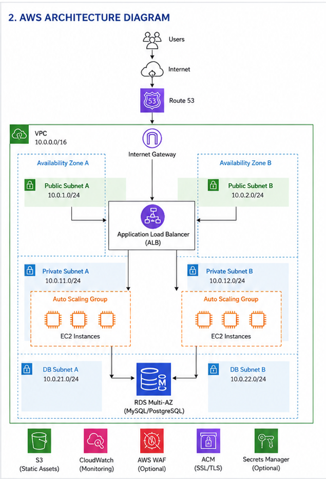

# Platform Overview

This platform is designed to deploy a secure, highly available, and scalable web app on AWS. It includes a VPC with public and private subnets across multiple AZs, an ALB, EC2 instances in an ASG, an RDS database in private subnets, and supporting AWS services for security, monitoring and storage. 

## What The Platform Does

- Host a web app accessible over HTTPS.
- Distribute traffic across multiple AZs for high availability.
- Automatically scale compute capacity based on demand.
- Store application data in a managed relational database.
- Store static assets (e.g., images, documents) in Amazon S3.
- Provide secure network isolation with public/private subnets.
- Monitor infrastructure and application health
- Mnanaged via IaC (Terraform)

## Requirements

High Availability - Multi-AZ deployment for ALB, EC2/ASG, and RDS
Scalability - Auto Scaling Group with min/max capacity
Security - Least privilege, security groups, private subnets for backend resources, encrypted data
Performance - ALB for efficient traffic distribution, RDS Multi-AZ
Reliability - Automated health checks and self-healing
Maintainability - Fully defined in Terraform with modular design 
Cost Efficiency - Right-sized instances, autoscaling, and S3 for static content
Observability - CloudWatch metrics/alerts, ALB access logs

## Getting Started

1. Install Terraform >= 1.5
2. Configure AWS credentials
3. Initialize Terraform: terraform init
4. Review and customize variables in terraform/environments/dev/terraform.tfvars
5. Plan: terraform plan
6. Apply: terraform apply

## Architectual Diagram

## Notes

- Two AZs used for high availability.
- ALB placed in public subnets.
- EC2 instnaces in private subnets for security.
- RDS is dedicated DB subnets with no direct internet access.
- NAT Gateways can be added in each public subnet if private subnets require outbound internet access.